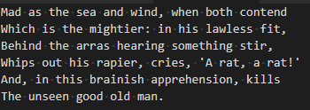

# selectWord README

Adds the "selectWord" (extension.selectWord) action to vscode which will select the word under the cursor. selectWord also supports multi-cursor, which results in multiple selected words.

By default, selectWord is bound to Cmd+Alt+W on OSX and Ctrl+Alt+W on all other platforms.

> Note: Many people change the keybinding to Ctrl+W (or Cmd+W), but to avoid conflicting behaviour, you need to first remove the exiting Ctrl+W (or Cmd+W) keybindings which close the editor window.

## Features

### Word selection

Place the cursor on a word and then press the keybinding:

### Multi-cursor word selection

Place the cursor in multiple locations by holding alt, then press the keybinding:

## Requirements

None.

## Extension Settings

None.

## Known Issues

None.
